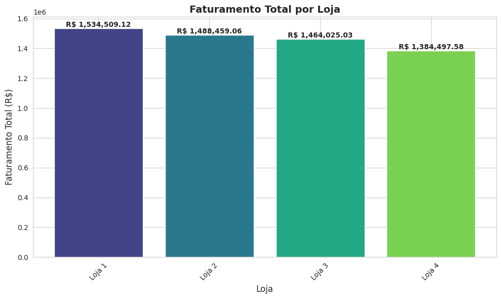
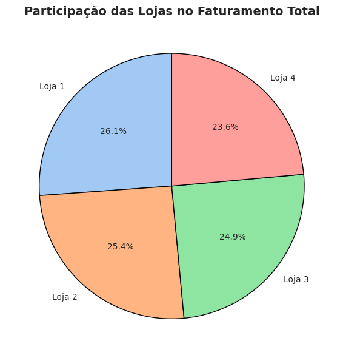
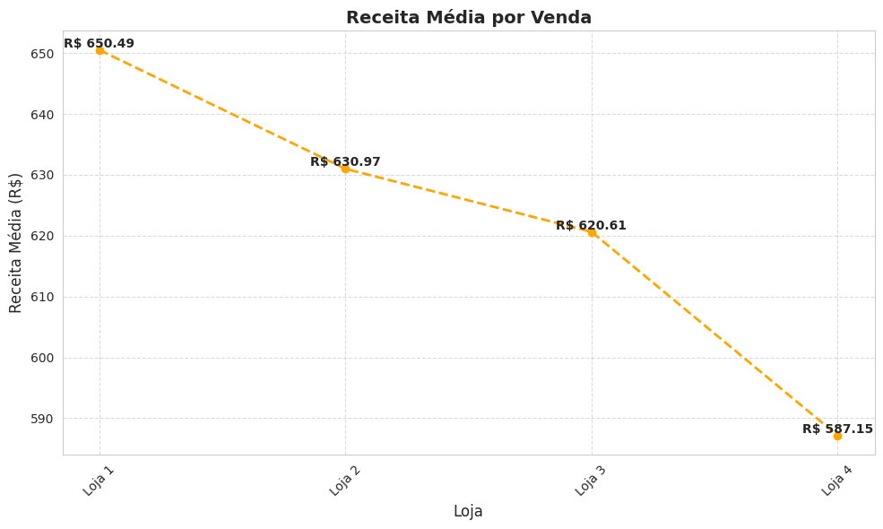
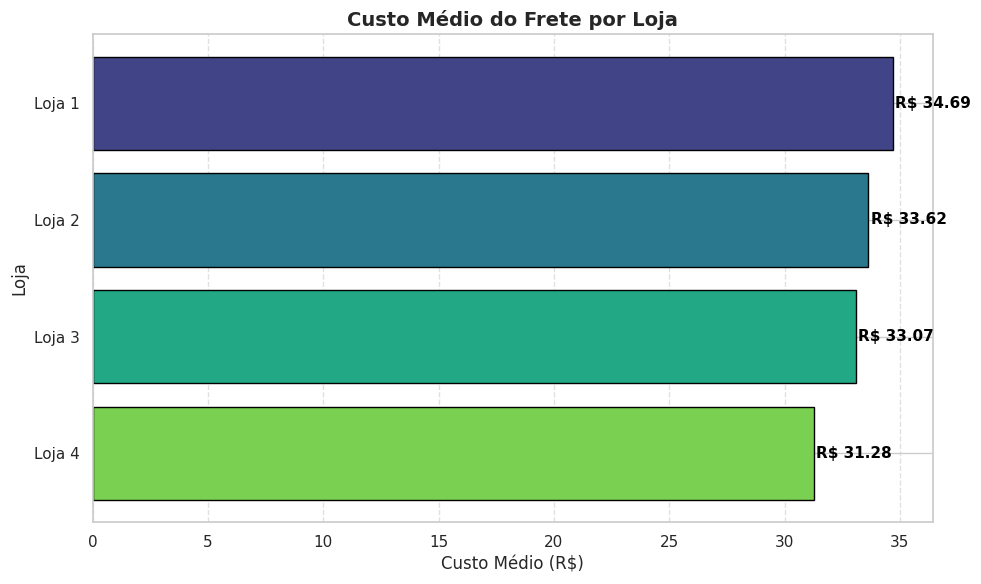

# 📊 Análise de Desempenho de Lojas – Alura Store

## 🎯 Objetivo
O presente projeto tem como propósito auxiliar o Sr. João, proprietário da rede de lojas vinculadas ao e-commerce Alura Store, na tomada de decisão sobre a venda de uma de suas unidades. A necessidade de alienação de uma loja surge como estratégia para direcionar investimentos em um novo negócio, exigindo uma análise criteriosa para identificar qual estabelecimento apresenta o menor desempenho e, portanto, é o candidato ideal para ser vendido.

Para atingir esse objetivo, serão aplicadas técnicas de análise de dados, explorando indicadores de desempenho das quatro lojas e outros fatores relevantes, permitindo compreender o impacto no comportamento dos consumidores e nas operações do e-commerce.
Este projeto insere-se no contexto do Desafio ONE Data Science, um desafio prático que busca proporcionar experiência real na aplicação de ciência de dados para decisões estratégicas no comércio digital. Com a análise aprofundada dos dados, espera-se fornecer ao Sr. João insights valiosos para uma escolha fundamentada e assertiva, garantindo a otimização dos investimentos e a sustentabilidade dos negócios.

## 📁 Estrutura do Projeto

📦 Desafio-ONE-Data-Science--Alura-Store
┣ 📜 analise_faturamento_lojas.ipynb
┣ 📁 assets              # Diretório de imagens
┗ 📄 README.md

## 🛠️ Tecnologias e Bibliotecas Utilizadas

- Python 🐍
- Pandas
- Matplotlib
- Seaborn
- Google Colab - Notebook

## 🧾 Fonte dos Dados

Os dados foram obtidos do repositório oficial do **Challenge de Data Science da Alura**:

- Loja 1: [`loja_1.csv`](https://raw.githubusercontent.com/alura-es-cursos/challenge1-data-science/refs/heads/main/base-de-dados-challenge-1/loja_1.csv)
- Loja 2: [`loja_2.csv`](https://raw.githubusercontent.com/alura-es-cursos/challenge1-data-science/refs/heads/main/base-de-dados-challenge-1/loja_2.csv)
- Loja 3: [`loja_3.csv`](https://raw.githubusercontent.com/alura-es-cursos/challenge1-data-science/refs/heads/main/base-de-dados-challenge-1/loja_3.csv)
- Loja 4: [`loja_4.csv`](https://raw.githubusercontent.com/alura-es-cursos/challenge1-data-science/refs/heads/main/base-de-dados-challenge-1/loja_4.csv)

Todos os arquivos foram lidos diretamente via URLs públicas no GitHub.

## 📈 Métricas Analisadas
Foram analisadas as seguintes métricas por loja:
- **Faturamento Total**
- **Categoria de Produto Mais Popular**
- **Média de Avaliação dos Clientes**
- **Produto Mais Vendido**
- **Produto Menos Vendido**
- **Custo Médio do Frete**

## 📋 Destaques da Análise

| **Métrica**             | 🏬 **Loja 1**     | 🏬 **Loja 2**           | 🏬 **Loja 3**     | 🏬 **Loja 4**     |
|-------------------------|------------------|------------------------|------------------|------------------|
| 💰 **Faturamento Total** | **1.534.509**    | 1.488.459              | 1.464.025        | 🔥 **1.384.498** |
| ⭐ **Média de Avaliação** | 3.98             | 4.04                    | **4.05**         | 4.00             |
| 🚚 **Frete Médio (R$)**  | 34.69            | 33.62                   | 33.07            | 🎯 **31.28**     |
| 🏆 **Categoria + Popular**| Móveis           | Móveis                  | Móveis           | Móveis           |
| 🔝 **Produto + Vendido**  | TV Led UHD 4K    | Iniciando em programação| Kit banquetas    | Cama box         |
| 🔻 **Produto - Vendido**  | Headset          | Jogo de tabuleiro       | Blocos de montar | Guitarra         |

## 📉 Visualizações Geradas

**Foram criados 3 gráficos utilizando a biblioteca `matplotlib`:**
### 📊 Gráfico de Barras: Faturamento total por loja

### 🥧 Gráfico de Pizza: Participação das Lojas no Faturamento Total

### 📈 Gráfico de Linha: Receita Média por Venda

### 📊 Custo Médio de Frete por Loja

## 📌 Conclusão

A loja recomendada para venda é a **Loja 4**, com base nos seguintes critérios:
- Menor **faturamento total**
- Avaliação inferior em relação às lojas 2 e 3
- Frete médio mais baixo, mas sem impacto relevante frente ao desempenho financeiro
- Não se destaca em nenhuma das métricas-chave analisadas em relação as outras lojas
- É importante ressaltar que outras análises complementares podem ser realizadas, essas análises adicionais podem fornecer insights ainda mais valiosos para a tomada de decisão.

Portanto, recomenda-se que o Sr. João venda a Loja 4, pois ela apresenta o desempenho mais fraco entre as quatro lojas analisadas, permitindo que ele invista o capital obtido em um novo negócio com maior potencial de retorno.

## 🤝 Como Contribuir

Sinta-se à vontade para contribuir com o projeto, encontrou um bug ou tem uma sugestão? Abra uma [issue](https://github.com/srkael/Challenge-ONE-Data-Science--Alura-Store/issues) ou envie um pull request.

---

## 👨‍💻 Autor

- **Rafael de Oliveira Pereira**
- GitHub: [srkael](https://github.com/srkael)
- Linkedin: [Rafael de Oliveira](https://www.linkedin.com/in/srkael/)

---

## 🙏 Agradecimentos

- Inspirado em projetos de sorteio online.
- Agradecimento especial à Oracle e à Alura pela oportunidade. Participar do programa ONE tem sido uma experiência incrível, repleta de aprendizado e crescimento. Também agradeço à comunidade de desenvolvedores por compartilhar conhecimento..
